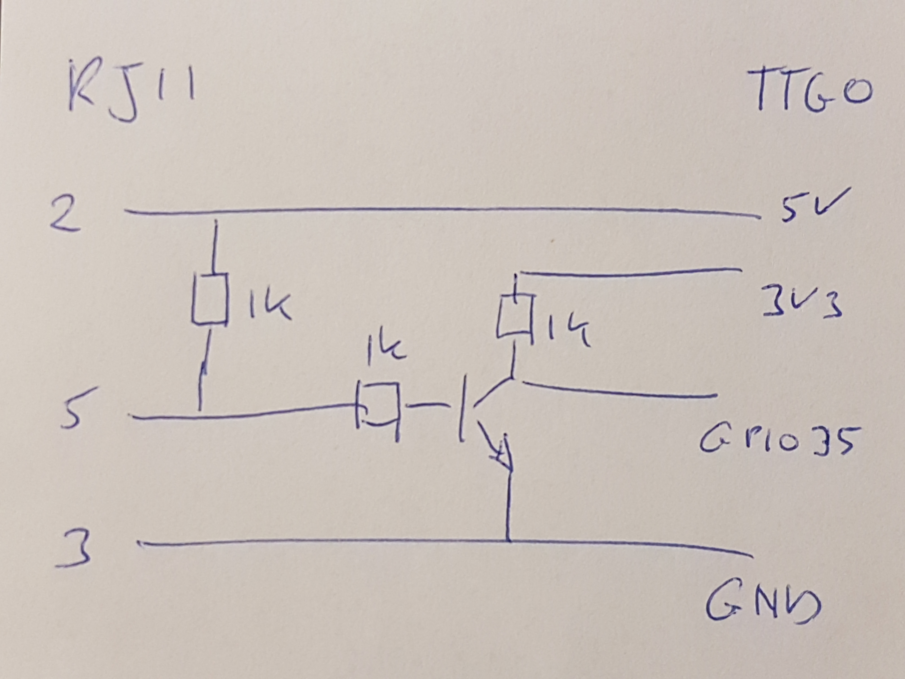

# LoRa-Slimme-Meter
This little box with TTGO reads the "Dutch Slimme Meter" values via the serial P1 Port and sends the values to the LoRa TTN network.
The Oled display shows the status, hashed meterid and the meter values electricity low, high, low-return, high-return and gas.

> LoRa Slimme Meter Box

> TTGO OLED display

> Wiring RJ11 connector to TTGO
