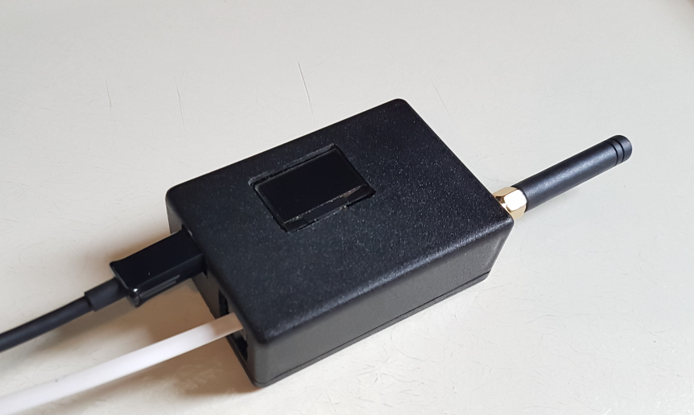

## P1 Slimme meter

#### Open source (hardware) P1 Slimme meter for the internet of things.
This little box with TTGO LoRa32 V1 board reads the "De Slimme Meter" (DSM) values via the serial P1 Port and sends the values to the LoRa TTN network. The OLED display shows the the meter values electricity low, high, low-return, high-return and gas. 
The software has been tested with the meters ISKRA, KAIFA, KAMSTRUP, LANDIS, SAGEMCOM with 9600 and 115200 baud.



> LoRa Slimme Meter Box


> TTGO OLED display

##Software Updates
Update to version 3 includes:
* MCCI Catena lora stack
* payload decoder has been adapted for TTN V3
* worker loop changed
* DEVEUI is read from chipid
* dsm parser update 
* detect auto baudrate (115200 or 9600) at startup
* software serial interface removed
* hashed meter id removed


##Configuration
In “config.h” you can define:
* the period time of sending updates (default 10 minutes)
* auto or fixed baudrate of the “Slimme meter”.
* Lora keys, APPEUI and APPKEY. (DEVEUI becomes TTGO board-id)


##Libraries

#### LMIC
There are several LIMC LoRaWan libraries. I use the LMIC library from MCCI-Catena, because this one is currently best maintained. 
Download the library from https://github.com/mcci-catena/arduino-lmic and put it in your [arduino-path]\libraries\
	
Take care that you change the frequency plan to Europe (if you are in Europe), because it is defaulted to the US. It can be changed in the file [arduino-path]\arduino-lmic-master\project_config\lmic_project_config.h
```
#define CFG_eu868 1
```

#### Monochrome OLED library
For the TTGO board, download the libraries below and put them in your [Arduino-path]\libraries
```
https://github.com/adafruit/Adafruit_SSD1306
https://github.com/adafruit/Adafruit-GFX-Library
```

## Hardware
The hardware serial port 0 of the TTGO s is used for reading the DSM. A software serial port is too slow for a speed of 115200 baud. 
Note: when you are debugging/uploading the program via the mico usb, disconnect the DSM from port 0.

The serial data levels from DSM must be inverted, see hardware wiring diagram.


> Wiring RJ11 connector to TTGO

## JSON Output
Example output of the TTN Payload decoder:
```
{
   "gas":24134.816,
   "hoog":16784.066,
   "hoogterug":2748.510,
   "laag":21445.900,
   "laagterug":1189.001,
   "meterid":88707712
}
```
